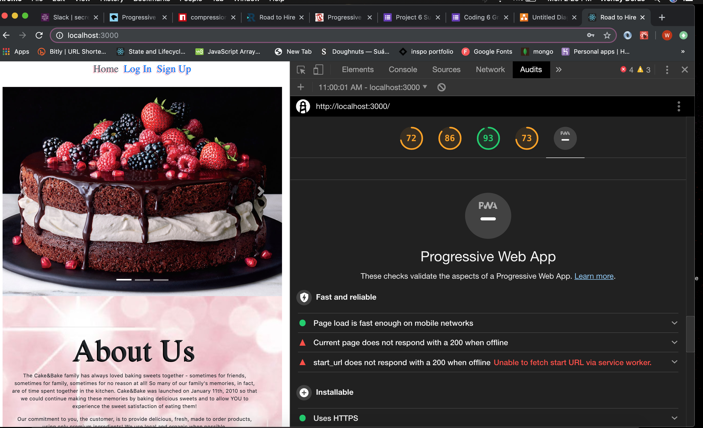

# Mobile Application with JWT Authentication

### Overview

This project is an e-commerce website centered around a Bakery. It contains three pages routed together through react. The home page has slider images. The product page contains products, pulled from a MongoDB database. A secure admin page has been added that allows access to the products. React and MongoDB is linked together through Express.The website has been modified to become a progressive web app that can be now be downloaded onto mobile devices.

### Installation 

1. git clone this repository to your local machine.
2. Open the code editor
3. Open the terminal
4. npm install
5. Create .env with your local mongoDB
6. npm run start

  
### Technologies
- React client application business in the front
- NodeJS + Express + Mongoose party in the back
- React Router 4.*
- Milligram CSS 
- JSON Web Token authentication flow

### Download Cake&Bake Mobil
- Open the link on your mobile device.
- On Safari, hit the download button on the bottom.
- Scroll to the right until you see Add to Home Screen and tap on it.
- Cake should now be available on your phone.

 

## Author
- __ https://github.com/wendyyderas

## Herokuapp

https://projectseis.herokuapp.com/rth

## License
This project is licensed under the MIT License - see the LICENSE.md file for details

